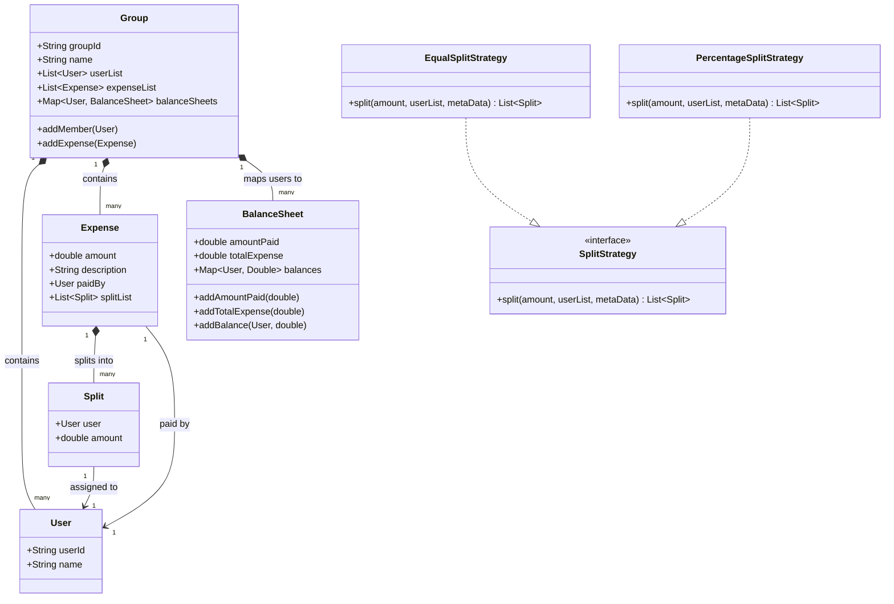
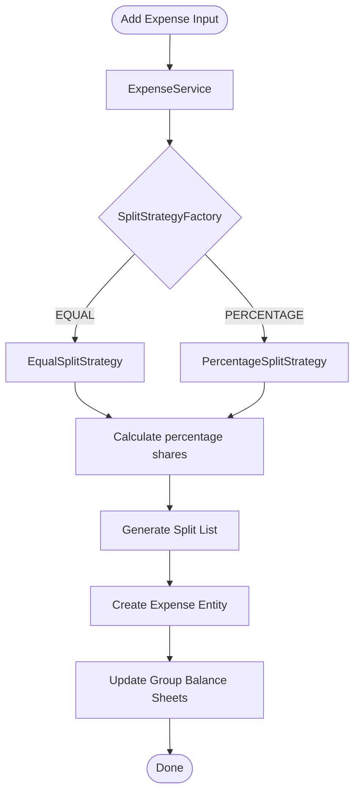

# 🏛️ System Design & Low-Level Design (LLD) in Java

Welcome to the **System Design and Low-Level Design (LLD)** repository! This repository serves as a comprehensive resource for understanding, implementing, and practicing object-oriented design principles, classic design patterns, and full-scale LLD case studies in Java.

---

## 📂 Repository Structure

The codebase is organized into classic **Design Patterns** and multiple production-grade **LLD case studies** (such as a Parking Lot system and a Splitwise expense sharing app).

```
System Design/
│
├── FactoryPatterns.pdf          # Slides and documentation on Factory Patterns
├── FactoryPatterns.pptx         # Editable presentation on Factory Design Patterns
│
└── LLD/                         # Low-Level Design Implementations
    ├── LLD.iml
    └── src/
        ├── DesignPatterns/      # Core Gang of Four (GoF) Design Patterns
        │   ├── AbstractFactory/ # Factory of factories pattern (Hyundai/Maruti Car factory)
        │   ├── Builder/         # Constructing complex objects step-by-step
        │   ├── FactoryMethod/   # Creation framework allowing subclass decisions
        │   ├── Observer/        # Weather monitoring system with pub-sub mechanics
        │   ├── Prototype/       # Object cloning pattern for vehicles/cars
        │   ├── SingleTon/       # Thread-safe double-checked lock Singleton
        │   └── Strategy/        # Dynamic payment strategy routing
        │
        ├── ParkingLot/          # Concurrency-Aware Parking Lot Case Study
        │   ├── Client.java      # Entry point / Concurrent Simulation test-harness
        │   ├── Enums/           # VehicleType, PaymentType, PricingStrategyType, etc.
        │   ├── Factory/         # Factories for Vehicles, Payments, and Pricing Strategies
        │   ├── Models/          # Object-Oriented Domain Entities (Gates, Spots, Tickets, etc.)
        │   ├── Service/         # Core Services (ParkingLot manager, PaymentProcessor)
        │   └── Strategy/        # Dynamic Spot-Allocation and Parking-Pricing Algorithms
        │
        ├── SnakeAndLadders/     # Snake & Ladders board game implementation
        │
        ├── SplitWise/           # Splitwise Expense Sharing System
        │   ├── Entities/        # Core models (User, Group, Expense, Split, BalanceSheet)
        │   ├── Enums/           # SplitType (EQUAL, PERCENTAGE)
        │   ├── Factory/         # SplitStrategyFactory for strategy resolution
        │   ├── Repository/      # In-memory storage for groups and expenses
        │   ├── Service/         # Service layer (ExpenseService, GroupService, BalanceSheetService)
        │   ├── Strategy/        # SplitStrategy implementations (Equal, Percentage)
        │   └── Main.java        # Splitwise application driver
        │
        └── SplitWisePractice2/  # Alternative practice implementation of Splitwise
```

---

## 🎨 Implemented Design Patterns

Here is a summary of the design patterns implemented inside `LLD/src/DesignPatterns/`:

| Pattern | Category | Use Case & Description | Key Package Location |
| :--- | :--- | :--- | :--- |
| **Abstract Factory** | Creational | Creates families of related objects (Engine, Tyres, Dashboard) without specifying concrete classes. Models `HyundaiFactory` and `MarutiFactory`. | [AbstractFactory](file:///c:/YASHIT/java_lec/System%20Design/LLD/src/DesignPatterns/AbstractFactory) |
| **Factory Method** | Creational | Defines an interface for creating an object, letting subclasses decide which class to instantiate. | [FactoryMethod](file:///c:/YASHIT/java_lec/System%20Design/LLD/src/DesignPatterns/FactoryMethod) |
| **Builder** | Creational | Separates the construction of a complex object (`Car`) from its representation, allowing step-by-step creation. | [Builder](file:///c:/YASHIT/java_lec/System%20Design/LLD/src/DesignPatterns/Builder) |
| **Prototype** | Creational | Clones existing objects (`Car`, `Vehicle`) rather than creating them from scratch, optimizing resource footprint. | [Prototype](file:///c:/YASHIT/java_lec/System%20Design/LLD/src/DesignPatterns/Prototype) |
| **Singleton** | Creational | Ensures a class has only one instance and provides a global point of access. Implemented with **Double-Checked Locking** for thread safety. | [SingleTon](file:///c:/YASHIT/java_lec/System%20Design/LLD/src/DesignPatterns/SingleTon) |
| **Observer** | Behavioral | Implements a subscription mechanism (Pub-Sub) to notify multiple observers (WebSite, Email, WhatsApp) of weather changes. | [Observer](file:///c:/YASHIT/java_lec/System%20Design/LLD/src/DesignPatterns/Observer) |
| **Strategy** | Behavioral | Defines a family of algorithms, encapsulates each one, and makes them interchangeable at runtime. Used for Payment Routing. | [Strategy](file:///c:/YASHIT/java_lec/System%20Design/LLD/src/DesignPatterns/Strategy) |

---

## 🚗 LLD Case Study: Concurrency-Aware Parking Lot

The `ParkingLot` system is a fully realized low-level design case study implementing OOP principles (SOLID), design patterns, and thread-safe operations.

### Key Features
1. **Multi-Floor & Multi-Spot Support**: Handles parking allocation for various vehicle types (Bikes, Cars, and Trucks).
2. **Dynamic Pricing Strategy**: Calculates fees dynamically using a `PricingStrategy` (e.g., time-based pricing) powered by the **Strategy Pattern**.
3. **Flexible Payment Integration**: Supports multiple payment modes (Cash, Card, UPI) processed through a factory-based `PaymentProcessor`.
4. **Thread-Safe Allocation**: Uses Atomic variables to prevent double-booking of parking spots under concurrent parking requests.

---

## 💸 LLD Case Study: Splitwise (Expense Sharing System)

The `SplitWise` package contains a fully functional Low-Level Design implementation of an expense-sharing application like Splitwise. It models users, groups, and expenses while providing flexible split computations and a transaction-minimization feature.

### Key Features
1. **Dynamic Expense Splitting**: Supports multiple split strategies (e.g., equal split, percentage-based split) powered by the **Strategy Pattern**.
2. **Modular Strategy Resolution**: Resolves strategies dynamically via a [SplitStrategyFactory](file:///c:/YASHIT/java_lec/System%20Design/LLD/src/SplitWise/Factory/SplitStrategyFactory.java) mapping to [SplitType](file:///c:/YASHIT/java_lec/System%20Design/LLD/src/SplitWise/Enums/SplitType.java).
3. **Automated Balance Sheet Tracking**: Maintains group-wide balance sheets for every member. Adding an expense automatically updates how much each member owes or is owed by the payer.
4. **Greedy Transaction Simplification**: Implements a transaction-minimization algorithm that reduces the absolute number of payment transfers required to settle all debts in a group.

### Core Architectural Components
* **Domain Models**:
  * [User](file:///c:/YASHIT/java_lec/System%20Design/LLD/src/SplitWise/Entities/User.java): Represents user details (ID, name).
  * [Group](file:///c:/YASHIT/java_lec/System%20Design/LLD/src/SplitWise/Entities/Group.java): Aggregates users, expenses, and maintains individual [BalanceSheet](file:///c:/YASHIT/java_lec/System%20Design/LLD/src/SplitWise/Entities/BalanceSheet.java) records.
  * [Expense](file:///c:/YASHIT/java_lec/System%20Design/LLD/src/SplitWise/Entities/Expense.java) & [Split](file:///c:/YASHIT/java_lec/System%20Design/LLD/src/SplitWise/Entities/Split.java): Represents transaction metadata and the individual user shares.
* **Services**:
  * [ExpenseService](file:///c:/YASHIT/java_lec/System%20Design/LLD/src/SplitWise/Service/ExpenseService.java): Creates expenses, applies strategies, and invokes the balance sheet updates.
  * [BalanceSheetService](file:///c:/YASHIT/java_lec/System%20Design/LLD/src/SplitWise/Service/BalanceSheetService.java): Manages updates to individual user balance sheets and prints statements.
  * [SimplifiedBalanceSheet](file:///c:/YASHIT/java_lec/System%20Design/LLD/src/SplitWise/Service/SimplifiedBalanceSheet.java): Implements transaction settlement/minimization.

#### 📊 System Class Diagram


#### 🔄 Expense Flow Architecture


### 🧮 Debt Simplification Algorithm
The core of the settlement system lies in [SimplifiedBalanceSheet.java](file:///c:/YASHIT/java_lec/System%20Design/LLD/src/SplitWise/Service/SimplifiedBalanceSheet.java). It reduces the number of payments using a greedy Priority Queue approach:
1. **Net Balance Calculation**: First, the total net balance of each user in the group is calculated (Received - Paid).
2. **Min/Max-Heap Partitioning**:
   * Users with positive net balances are pushed into a Max-Heap (`creditors`) ordered descending by credit amount.
   * Users with negative net balances are pushed into a Min-Heap (`debtors`) ordered descending by absolute debt amount.
3. **Iterative Settlement**:
   * The largest creditor and the largest debtor are popped.
   * A settlement is made for `min(creditAmount, absolute(debtAmount))`.
   * Net balances are updated and outstanding users are pushed back into the heaps until all debts are cleared.

---

## ⚙️ How to Run

### Prerequisites
* Java Development Kit (JDK) 8 or higher
* An IDE such as IntelliJ IDEA or Eclipse

### Running the Parking Lot Simulation
To run the simulation which demonstrates multi-threaded parking requests:
1. Navigate to `LLD/src/ParkingLot/`.
2. Open and run the [Client.java](file:///c:/YASHIT/java_lec/System%20Design/LLD/src/ParkingLot/Client.java) file.

### Running the Splitwise Simulation
To run the Splitwise simulation:
1. Navigate to `LLD/src/SplitWise/` or `LLD/src/SplitWisePractice2/`.
2. Open and run the [Main.java](file:///c:/YASHIT/java_lec/System%20Design/LLD/src/SplitWise/Main.java) file.

---

## 💡 Developer Notes & Concurrency Analysis

### 🔒 Thread-Safe Spot Allocation
In [ParkingSpot.java](file:///c:/YASHIT/java_lec/System%20Design/LLD/src/ParkingLot/Models/Parking/ParkingSpot.java), thread safety is implemented to prevent race conditions when multiple gates try to occupy the same spot simultaneously:
```java
public AtomicBoolean occupied = new AtomicBoolean(false);

public boolean tryOccupy(){
    return occupied.compareAndExchange(false, true);
}
```

> [!WARNING]
> **Important Concurrency Note**:
> `AtomicBoolean.compareAndExchange(expectedValue, newValue)` returns the **witness value** (the value *before* the attempted transition).
> * If the spot was free (`false`), `compareAndExchange` successfully changes it to `true` and returns **`false`**.
> * If the spot was already occupied (`true`), the swap fails and it returns **`true`**.
>
> In [ParkingLot.java](file:///c:/YASHIT/java_lec/System%20Design/LLD/src/ParkingLot/Service/ParkingLot.java#L55), the spot-occupancy check expects a truthy result:
> `if(spot != null && spot.tryOccupy())`
>
> Since successful acquisition returns `false` (the witness value), this logic will fail to park the vehicle and might allow booking on an occupied spot instead. To align this with standard boolean checks, consider updating [ParkingSpot.java](file:///c:/YASHIT/java_lec/System%20Design/LLD/src/ParkingLot/Models/Parking/ParkingSpot.java#L21-L23) to use **`compareAndSet`**:
> ```java
> public boolean tryOccupy(){
>     return occupied.compareAndSet(false, true); // Returns true on success
> }
> ```

---
